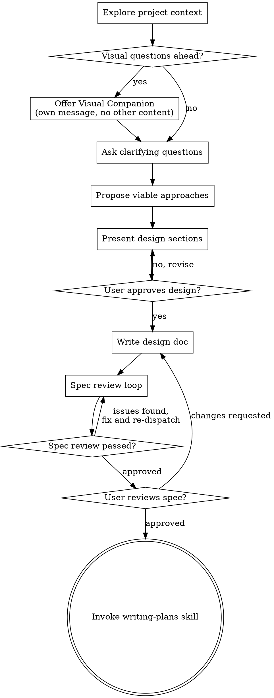

# Brainstorming Design Problems

Help turn unresolved design problems into validated designs and specs through collaborative dialogue.

Start by understanding the current project context, then ask questions one at a time to refine the design problem. Once you understand the problem well enough to design it, present the design in sections, get approval, write the spec, complete the spec review loop, and wait for the user's approval of the written spec before handing off to `writing-plans`.

## Trigger Boundary

Use `brainstorming` only when the request or prior analysis still contains unresolved design work that must be decided before implementation.

Invoke it when at least one of these is true:
- Multiple valid design approaches exist and there is no clear winner yet
- The scope is vague, open-ended, or under-specified
- Significant trade-offs need to be decided before implementation
- The work crosses subsystem boundaries that are still unclear

Do **not** invoke it merely because behavior will change.

Do **not** invoke it when the requirement is already specific enough to implement after understanding the relevant context.

Common non-brainstorming cases:
- Explicit bug fixes with a clear expected behavior
- Small, bounded behavior changes with specified platform rules or branch conditions
- Routing, platform-conditional, config, copy, style, or wiring changes with no open design question
- Requests that only map an existing input to an already-defined action
- Any task that can proceed directly from understanding the relevant context to planning, implementation, or TDD without inventing requirements

<HARD-GATE>
Do NOT hand off to `writing-plans`, invoke any implementation skill, write any code, scaffold any project, or take any implementation action until you have presented the design, completed the spec review loop, and received the user's approval of the written spec. This applies every time `brainstorming` is invoked, regardless of perceived simplicity.
</HARD-GATE>

## Anti-Pattern: "This Is Too Simple To Need A Design"

Every project that reaches `brainstorming` goes through this process. Once the skill is invoked, do not skip design just because the work looks small. The design can be short for a truly simple design problem, but you MUST still present it and get approval.

## Checklist

You MUST create a task for each applicable item below and complete the applicable items in order:

1. **Explore project context** — check files, docs, recent commits
2. **Offer visual companion** (if topic will involve visual questions) — this is its own message, not combined with a clarifying question. See the Visual Companion section below.
3. **Ask clarifying questions** — one at a time, understand purpose/constraints/success criteria
4. **Propose approaches** — present 2-3 viable approaches when multiple viable approaches exist; otherwise explain why one approach is now the only viable option
5. **Present design** — in sections scaled to their complexity, get user approval after each section
6. **Write design doc** — save to `docs/superpowers/specs/YYYY-MM-DD-<topic>-design.md` and commit
7. **Spec review loop** — dispatch the `spec-document-reviewer` subagent through `my-subagent` with precisely crafted review context (never your session history); fix issues and re-dispatch until approved (max 3 iterations, then surface to human)
8. **User reviews written spec** — ask user to review the spec file before proceeding
9. **Transition to planning** — invoke `writing-plans` to create the implementation plan

## Process Flow

**The terminal state is invoking `writing-plans`.** After `brainstorming` completes, do NOT hand off to any skill other than `writing-plans`. `writing-plans` is the only next skill after `brainstorming`.

## The Process

**Understanding the problem:**

- Check out the current project state first (files, docs, recent commits)
- Before asking detailed questions, assess scope: if the request describes multiple independent subsystems (e.g., "build a platform with chat, file storage, billing, and analytics"), flag this immediately. Don't spend questions refining details of a project that needs to be decomposed first.
- If the project is too large for a single spec, help the user decompose into sub-projects: what are the independent pieces, how do they relate, what order should they be built? Then brainstorm the first sub-project through the normal design flow. Each sub-project gets its own spec → plan → implementation cycle.
- For appropriately-scoped projects, ask questions one at a time to refine the request
- Prefer multiple choice questions when possible, but open-ended is fine too
- Only one question per message - if a topic needs more exploration, break it into multiple questions
- Focus on understanding: purpose, constraints, success criteria

**Exploring approaches:**

- Present 2-3 viable approaches with trade-offs when multiple viable approaches exist
- If only one viable approach remains after clarification, say so explicitly and explain why
- Present options conversationally with your recommendation and reasoning
- Lead with your recommended option and explain why

**Presenting the design:**

- Once you understand the problem well enough, present the design
- Scale each section to its complexity: a few sentences if straightforward, up to 200-300 words if nuanced
- Ask after each section whether it looks right so far
- Cover: architecture, components, data flow, error handling, testing
- Be ready to go back and clarify if something doesn't make sense

**Design for isolation and clarity:**

- Break the system into smaller units that each have one clear purpose, communicate through well-defined interfaces, and can be understood and tested independently
- For each unit, you should be able to answer: what does it do, how do you use it, and what does it depend on?
- Can someone understand what a unit does without reading its internals? Can you change the internals without breaking consumers? If not, the boundaries need work.
- Smaller, well-bounded units are also easier for you to work with - you reason better about code you can hold in context at once, and your edits are more reliable when files are focused. When a file grows large, that's often a signal that it's doing too much.

**Working in existing codebases:**

- Explore the current structure before proposing changes. Follow existing patterns.
- Where existing code has problems that affect the work (e.g., a file that's grown too large, unclear boundaries, tangled responsibilities), include targeted improvements as part of the design - the way a good developer improves code they're working in.
- Don't propose unrelated refactoring. Stay focused on what serves the current goal.

## After the Design

**Documentation:**

- Write the validated design (spec) to `docs/superpowers/specs/YYYY-MM-DD-<topic>-design.md`
  - (User preferences for spec location override this default)
- Commit the design document to git

**Spec Review Loop:**
After writing the spec document:

1. Dispatch the `spec-document-reviewer` subagent through `my-subagent` (see `spec-document-reviewer-prompt.md`)
2. If Issues Found: fix, re-dispatch, repeat until Approved
3. If loop exceeds 3 iterations, surface to human for guidance

**User Review Gate:**
After the spec review loop passes, ask the user to review the written spec before proceeding:

> "Spec written and committed to `<path>`. Please review it and let me know if you want to make any changes before we start writing out the implementation plan."

Wait for the user's response. If they request changes, make them and re-run the spec review loop. Only proceed once the user approves.

**Planning Hand-off:**

- Invoke the writing-plans skill to create a detailed implementation plan
- Do NOT hand off to any other skill here. `writing-plans` is the next step.

## Key Principles

- **One question at a time** - Don't overwhelm with multiple questions
- **Multiple choice preferred** - Easier to answer than open-ended when possible
- **YAGNI ruthlessly** - Remove unnecessary features from all designs
- **Explore alternatives** - Present multiple viable approaches when they exist; otherwise explain why one viable approach remains
- **Incremental validation** - Present design, get approval before moving on
- **Be flexible** - Go back and clarify when something doesn't make sense

## Visual Companion

A browser-based companion for showing mockups, diagrams, and visual options during brainstorming. Available as a tool — not a mode. Accepting the companion means it's available for questions that benefit from visual treatment; it does NOT mean every question goes through the browser.

**Offering the companion:** When you anticipate that upcoming questions will involve visual content (mockups, layouts, diagrams), offer it once for consent:
> "Some of what we're working on might be easier to explain if I can show it to you in a web browser. I can put together mockups, diagrams, comparisons, and other visuals as we go. This feature is still new and can be token-intensive. Want to try it? (Requires opening a local URL)"

**This offer MUST be its own message.** Do not combine it with clarifying questions, context summaries, or any other content. The message should contain ONLY the offer above and nothing else. Wait for the user's response before continuing. If they decline, proceed with text-only brainstorming.

**Per-question decision:** Even after the user accepts, decide FOR EACH QUESTION whether to use the browser or the terminal. The test: **would the user understand this better by seeing it than reading it?**

- **Use the browser** for content that IS visual — mockups, wireframes, layout comparisons, architecture diagrams, side-by-side visual designs
- **Use the terminal** for content that is text — requirements questions, conceptual choices, tradeoff lists, A/B/C/D text options, scope decisions

A question about a UI topic is not automatically a visual question. "What does personality mean in this context?" is a conceptual question — use the terminal. "Which wizard layout works better?" is a visual question — use the browser.

If they agree to the companion, read the detailed guide before proceeding:
`visual-companion.md`
